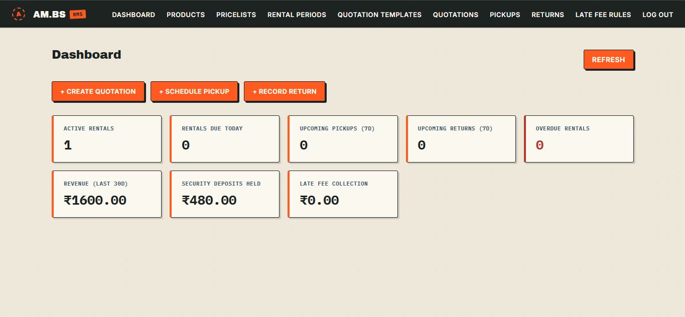
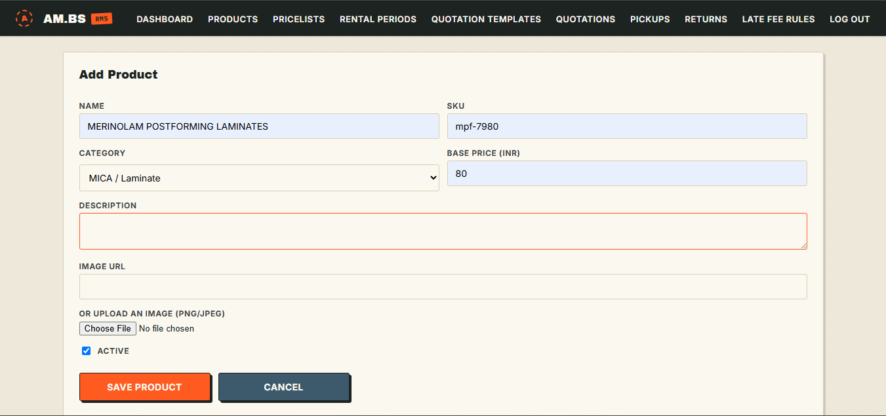

<div align="center">

```
      ___           ___            ___           ___     
     /  /\         /  /\          /  /\         /  /\    
    /  /::\       /  /::|        /  /::\       /  /::\   
   /  /:/\:\     /  /:|:|       /  /:/\:\     /__/:/\:\  
  /  /::\ \:\   /  /:/|:|__    /  /::\ \:\   _\_ \:\ \:\ 
 /__/:/\:\_\:\ /__/:/_|::::\  /__/:/\:\_\:| /__/\ \:\ \:\
 \__\/  \:\/:/ \__\/  /~~/:/  \  \:\ \:\/:/ \  \:\ \:\_\/
      \__\::/        /  /:/    \  \:\_\::/   \  \:\_\:\  
      /  /:/        /  /:/      \  \:\/:/     \  \:\/:/  
     /__/:/        /__/:/        \__\::/       \  \::/   
     \__\/         \__\/     •       ~~         \__\/    
```

<sub>◤◢◤◢◤◢◤◢◤◢◤◢◤◢◤◢◤◢◤◢◤◢◤◢◤◢◤◢◤◢◤◢◤◢◤◢◤◢◤◢◤◢◤◢◤◢◤◢◤◢◤◢</sub>

### ✦ Built Beyond Enough ✦

[](#)
[](#)
[](#)
[](#)

<sub>- TECH STACK -</sub>
</div>

<br/>

---

## Team #55

<div align="center">

| Name | Standing | GitHub |
|:---:|:---:|:---:|
| Ayush Mishra | Lead | [@ayushmishra-am001](https://github.com/ayushmishra-am001) |
| Bipasha Routh | Core | [@itisbipasha](https://github.com/itisbipasha) |

</div>

<br/>

---

## Problem Statement

> Rental Management System:
> Design and develop an enhanced Rental Management experience that enables rental businesses to efficiently monitor their operations from a single interface while automating common rental workflows. The solution should improve operational efficiency, reduce manual intervention, and provide better visibility into rental activities throughout the complete rental lifecycle.

<br/>

---

## Showcase

<div align="center">

&nbsp;&nbsp;

</div>

<br/>


